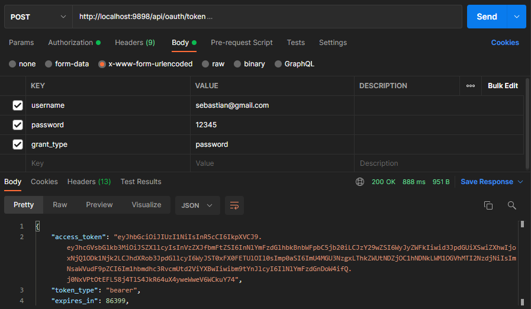
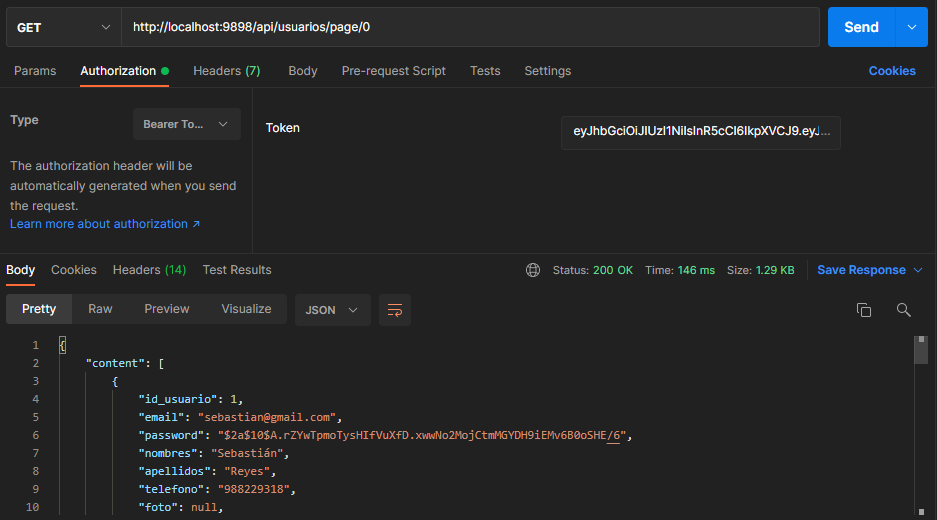

# API RESTfull con Spring Boot - Manga

## Test Hosting

Base URL:

https://test-apimanga.herokuapp.com/api/

## Endpoints

### Públicos

```bash
(POST) http://localhost:9898/api/usuarios/registro/cliente
(GET)  http://localhost:9898/api/mangas/page/{page}
(GET)  http://localhost:9898/api/mangas/{id}
(GET)  http://localhost:9898/api/mangaka
(GET)  http://localhost:9898/api/mangaka/{id}
```

### Privados (Verificación con JWT y Basic Auth)

```bash
(POST) http://localhost:9898/api/oauth/token
(GET)  http://localhost:9898/api/usuarios/page/{page}
```

## Programación

Se define que roles pueden consumir este recurso con **@Secured**

```java
@Secured({ "ROLE_ADMIN" }) //Es más fácil definir los roles que pueden acceder a este recurso
@GetMapping("/page/{page}")
public Page<Usuario> listarUsuarios(@PathVariable Integer page) {
    return service.paginacionUsuarios(PageRequest.of(page, 15));
}
```

Cada cliente que quiera consumir esta API deberá ser registrado en esta configuración que se encuentra en **auth/AuthServerConfig.java**

```java
@Override
public void configure(ClientDetailsServiceConfigurer clients) throws Exception{
    clients.inMemory().withClient("mangastore-webapp") //Nombre del cliente
    .secret(passwordEncoder.encode("m4ng4st0r3!")) //Contraseña
    .scopes("read","write")
    .authorizedGrantTypes("password","refresh-token")
    .accessTokenValiditySeconds(86400) //Tiempo que durará el token en segundos
    .refreshTokenValiditySeconds(86400);
}
```

## Consultas

### Autenticación y entrega de token

Para autenticarse se debe ingresar un correo y contraseña, se validará si son correctos y te darán un token **(acces_token)** el cual debes ingresar en tus consultas. El token expira en 3 días



### Consulta con JWT

Para consultar se debe ingresar en token dentro de los Headers.

Ejemplo con Postman:


